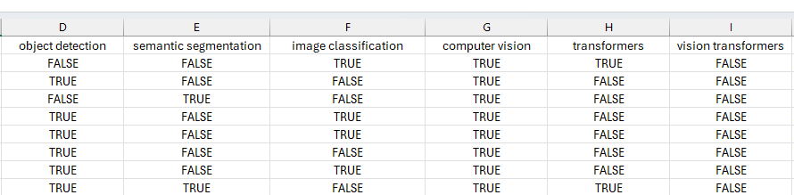
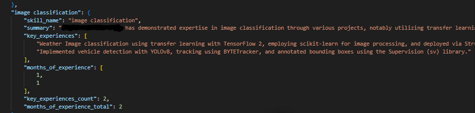

# 🧠 AIAgent - HR Application Assistant

## Overview

**AIAgent** is an intelligent HR Agent built to streamline and enhance workforce management and recruitment process. Designed specifically for modern HR departments struggling with high volumes of job applications, AIAgent leverages advanced AI models to **automatically parse resumes**, **evaluate candidate skills**, and **generate ranked shortlists**—making hiring **faster, fairer, and more accurate**.

This LLM-based application integrates cutting-edge Vision-Language and Large Language Models to understand resume layouts, grade skill presence, evaluate expertise levels for each skill, generate structured skill summaries, and rerank top candidates.


---

## 🚨 The Problem

Modern HR departments face an overwhelming volume of applications for every job posting, making it nearly impossible for human recruiters to efficiently review and evaluate each candidate. This results in:

- **Significant delays** in the hiring process
- **Overlooked qualified candidates**
- **Inconsistent and robust hiring decisions**
- **Vulnerability to keyword stuffing / resume hacking** – Many ATS can be tricked by applicants who simply copy job description skills into their resume without real experience, leading to unqualified candidates advancing in the process.  

These challenges make it difficult for companies to build strong, diverse, and high-performing teams.

#### Weaknesses of conventional Applicant Tracking Systems (ATS):
- **Inability to process diverse resume formats and layouts**: difficulties in accurately parsing resumes that deviate from rigid highly standardized formats like including complex tables, columns by LaTeX
- **Over-reliance on keywords**: Candidates may be overlooked if they don't use exact terms from the job description.
- **Lack of context, lack of language understanding**: These methods often miss nuances like transferable skills, highly similar skills, or potential.
- **Lack of fine-grained filtering**: "resume hacking" or "keyword stuffing" may trick ATS. Also  heavily on formal qualifications and quantifiable hard skills such as degrees, certifications, and specific technical abilities. However, ATS may miss the responsibilities, scope, and experience gained in the different environments.
- **Lack of ranking model based on textual content of resumes**. ATS ranks only based on the existence of skills, education, certificates, and years of experience.


---

## ✅ The Solution

AIAgent is an AI-powered HR Agent designed to transform how organizations handle recruitment. It addresses these challenges by:

- **Automatically screening resumes** with layout-aware PDF understanding
- **Identifying top candidates** using job-specific skill assessment
- **Providing consistent shortlists** through structured evaluation and reranking
- **Prevents keyword stuffing / resume hacking** – Uses a Fine-grained Skill Grader and Proficiency-Based Candidate Filtering to verify that claimed skills are backed by genuine, role-relevant experience before shortlisting.  


This ensures a hiring process that is:
- **Faster** – drastically reducing time-to-hire
- **Fairer** – evaluating candidates objectively
- **More accurate** – matching resumes to role requirements with high precision

By removing manual bottlenecks, mitigating keyword-stuffing tricks, and introducing multi-dimensional skill validation, AIAgent significantly improves the **quality and consistency** of hiring decisions.


---

## 📁 HR AIAgent Workflow

Implemented in a Graph-based Jupyter Notebook (`graph.ipynb`) using modular LangChain components. The system comprises four main components:

### 1. 📄 PDF information Extraction
- PDF Layout Understanding
- Uses **Qwen 2.5 VLM** for visually structured extraction from PDF resumes.
- Parses layout to intelligently retrieve text blocks in context.

---

### 2. 🧪 Skill Grader

- Checks if a **desired skill** is explicitly present in a resume.
- Uses a **binary scoring system** (`True`/`False`).
- Built with `LangChain`, `Pydantic`, and `GPT-4o`.

#### Chain Summary
- Input: Resume content + target skill
- Output: `True` if skill is demonstrated with evidence, `False` otherwise

```python
# True if clearly mentioned or shown in experience/projects
binary_score: bool = True | False
```


---

### 3. 🔎 1st Screening Step – Skill-Based Filtering

- Resumes are evaluated based on required skills using a binary skill table (with True/False values).
- Only resumes with True for all required skills are selected to move forward.
- This step filters out unqualified candidates, narrowing the pool to those who meet the minimum skill criteria.
---

### 4. 🧪 Fine-grained Skill Grader
The **Fine-grained Skill Grader** performs detailed, context-aware skill assessment for each candidate.  
- **Granular evidence extraction** – Identifies concrete instances where a skill was applied, capturing project descriptions, responsibilities, and measurable outcomes.  
- **Experience quantification** – Calculates both the **number of distinct key experiences** and the **aggregate duration** (in months) for each skill.  
- **Context validation** – Mitigates “keyword stuffing” by verifying that skills are substantiated with real-world, domain-relevant experience rather than superficial mentions.  

This step transforms skill detection from a binary check into a **multi-dimensional evaluation**, enabling recruiters to differentiate between superficial familiarity and genuine expertise.  

Example of grader output:


---

### 5. 🔎 2nd Screening Step – Proficiency-Based Candidate Filtering
This stage applies **customizable, rule-based filtering** on top of fine-grained skill data.  
- **HR-defined decision logic** – Uses thresholds such as *minimum number of key experiences* and *minimum cumulative months of experience* to define acceptable proficiency levels.  
- **Precision candidate pruning** – Eliminates candidates whose practical exposure falls below the required benchmarks, even if they pass basic skill matching.  
- **Role-specific adaptability** – Filtering criteria can be tuned per role to ensure alignment with both technical complexity and business needs.  

By leveraging structured, quantitative skill metrics, this step ensures only candidates with **verified, role-ready experience** progress to the next screening stage. 
 
---

### 6. 🧠 Skill Summary Writer

- Evaluates skill depth if the skill is found in a resume.
- Generates a **structured summary** including:
  - Proficiency level
  - Key achievements
  - Estimated years of experience
  - Confidence score

#### Output Format:
```json
"transformers": {
    "skill_name": "transformers",
    "proficiency_level": "Advanced",
    "summary": "He demonstrates advanced proficiency in transformers, particularly through his work on NLP projects utilizing transformer-based architectures. He has applied these techniques in real-world scenarios, such as the SentiScope sentiment analysis application and the Talks Summarizer project, both of which leverage Hugging Face Transformers. His experience includes implementing end-to-end ML pipelines and integrating transformers into modular and extensible systems, showcasing a deep understanding of transformer models and their applications in NLP.",
    "key_experiences": [
        "Applied deep learning techniques and transformer-based architectures to solve real-world NLP challenges during his role as a Machine Learning Engineer at DEPI.",
        "Developed the SentiScope sentiment analysis application, featuring a modular pipeline with pre-configured models and transformers for ease of use and extensibility.",
        "Created the Talks Summarizer, an end-to-end summarization app leveraging Hugging Face Transformers for processing text into concise summaries."
    ],
    "years_of_experience": "4",
    "confidence_score": 0.9
}
```

---

### 7. 📊 Resume Reranker

- Ranks resumes against an **ideal candidate profile**.
- Optimizes final selection for hiring teams.
- Uses **Qwen3-Reranker-8B** to sort shortlisted resumes.

---

### 8. 🎖️ 3rd screening step – Ranking-Based Selection
- Resumes that passed the 1st screening are compared against an ideal candidate profile, which defines the most desirable combination of skills, experience, and qualifications.
- Each resume is scored or ranked based on how closely it matches this ideal profile.
- Top-ranked resumes are selected for the next stage (e.g., interview or manual review), ensuring focus on the most promising candidates.
---


## 📈 Benefits

- **Save time** with automatic screening
- **Improve fairness** with objective evaluations
- **Enhance quality** of hires through structured insights
- **Support recruiters** with smart, AI-driven decisions

## ✨ AIAgent Input
- Resume collection
- list of desired skills
- profile of an ideal candidate---

## 🎯 Filtering Tools
- 🔎 1st Screening Step – Skill-Based Filtering
- 🎖️ 2nd screening step – Ranking-Based Selection

## 🚀 Technologies Used

| Component            | Technology               |
|---------------------|--------------------------|
| PDF Parsing         | Qwen 2.5 VLM             |
| Skill Grading       | GPT-4o + LangChain       |
| Summary Generation  | GPT-4o + Pydantic        |
| Reranking           | Qwen3-Reranker-8B        |
| Notebook Framework  | Jupyter + LangChain Graph |

---


## 🔧 How to Use

1. Clone this repo and open `graph.ipynb`.
2. Upload resumes in PDF format.
3. Define desired skills and ideal candidate traits.
4. Run the notebook cells step-by-step.
5. View graded skills, summaries, and top-ranked candidates.


---

## 📬 Contact

For more information or integration support, reach out to the AIAgent team.
